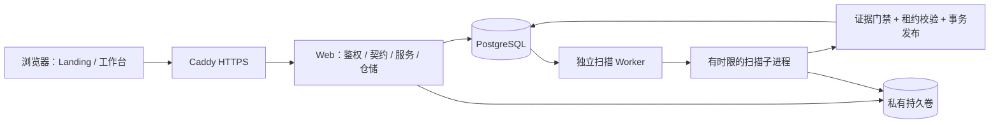

# 2026-09-23 生产候选版交付与验收

本轮在第二轮工作台的独立副本中完成。桌面原项目、首版与第二版 ZIP 均保留；本轮包含可运行源码、构建产物、生产部署配置和工程验证记录，未向 GitHub 推送或向公网发布。

## 审计、蓝图与实施顺序

先输出 [P0/P1 系统审计](system-audit.md) 与 [Landing 文案/组件蓝图](landing-blueprint.md)，再按模块实现。保留轻量原生 ES 模块工作台与 FastAPI 服务，Landing 独立采用 Vite + 严格 TypeScript + Tailwind，最终由同一个服务提供静态页面。

## 关键改造及结果

| 改造前 | 现在 | 验证依据 |
| --- | --- | --- |
| 非法 token scopes 过滤为空后可能扩大权限，降权后沿用旧角色 | 非法/空 scope 拒绝，当前角色与签发 scope 取交集；界面显式选择权限 | 身份安全回归 |
| OIDC 不验签，SSO 自动按同名用户绑定 | JWT 验签及 issuer/audience/nonce/有效期校验，浏览器绑定 state，显式企业空间，禁止同名接管 | 伪造签名、重放、跨企业与配置测试；真实 IdP 尚待接入验收 |
| 信任任意转发 IP，worker 与 web 重复启动 | Caddy 明确信任地址，数据库限流，web/worker 分离 | 代理伪造回归、Caddy 配置检查、容器运行 |
| 取消或重新领取后，旧扫描仍可能发布结果 | 每次领取有唯一 lease，事务内校验执行权；取消、超时和旧 lease 均不能发布 | 双进程领取、过期租约、取消期间解析、超时终止测试 |
| 上传体和解析资源边界不完整 | 单请求 110 MiB / 单文件 50 MiB / 20 份证据 / PDF 500 页；接收超时、暂存耗尽提示；原生 PDF 检查在扫描执行进程中 | 原始 ASGI、真实 PDF 与子进程测试 |
| 决策迟到响应或旧版本可能覆盖新视图/记录 | 会话、任务和版本守卫；生产决策必须带 revision；409 保留人工输入 | DOM 生命周期、后端 CAS 与真实 HTTPS 流程 |
| 评论/整改字段未进入 FormData，整改状态与后端不一致 | 明确 name 字段和 DONE/CANCELLED 契约 | DOM 提交回归 + 浏览器实际提交与数据库结果 |
| 仅有有限类型检查、全局故障缺少反馈 | 新边界严格类型、离线/异常可恢复提示、可注入脱敏监控 | tsc strict、运行时校验与异常回归 |
| 页面入口分散、内容与工作台体验脱节 | 新首页、真实 /app CTA、三种合成风险演示、方案与 FAQ | 浏览器核销/存疑/备注、手机导航及入口测试 |

SafeHtml 继续保护所有动态工作台 HTML。Landing 动态文本使用 textContent。核销通过必须等待服务器确认，不对合规结论做乐观通过。

## 验证结果

后端 **380 passed / 7 skipped**（含 PostgreSQL 5 项）；前端 **118 个实质场景**与 Landing **10 项**全部通过。Python lint、类型检查、构建与已知漏洞审计通过；前端 ESLint 0 错误、2 个既存警告。生产模式的 Docker + PostgreSQL + Caddy HTTPS 九阶段主流程已实际通过。

最终机器可读汇总位于 `outputs/production/verification-summary.json`；浏览器记录位于 `outputs/production/browser-checks.json`。测试不是只核对字符串：覆盖真实表单、请求竞态、取消、读取二进制响应体、任务租约、独立子进程、数据库及真实 HTTP/HTTPS 主流程。

API 烟测详情见 [API 烟测与 CI](api-smoke.md)，部署镜像验证见 [部署说明](deployment.md)。GitHub Actions 配置已交付，但尚未在用户 GitHub 仓库运行，不能把本机通过写成远端 CI 已通过。

## 视觉与交互变化

- 首屏以“截标之前，把每一条风险核对清楚”聚焦真实工作，低饱和松绿与暖中性底色减少压迫感。
- 风险数量、核验进度、原文位置分别承担清晰层级；危险项不与普通信息争夺同等注意力。
- 首页演示可以选择缺证据、有效期存疑与双向引用齐全的场景，体验人工确认、撤回存疑和独立备注；不会写入真实工作区。
- 手机为纵向内容和原生导航；FAQ 使用原生 details，无 JavaScript 时正文、价格说明、链接和 FAQ 仍可使用。
- 首屏无外部字体或位图请求。Landing 的生产 JS gzip 约 4.28 KB、CSS gzip 约 8.91 KB；动效尊重减少动态效果设置。分享图使用 PNG 以兼容 OpenGraph 消费端。
- 资源体积与本机体验不能替代真实用户 Core Web Vitals。没有声称已达到线上 LCP/INP/CLS 或转化率目标。

最后一次浏览器回查因浏览器管理策略校验不可用被拒绝，重复一次仍不可用。此前已完成首页响应式/演示和工作台登录/评论/整改/决策验收；最终新增的二进制下载清理与跨标签通知有自动化回归，未冒充已在最终浏览器构建复验。

## 当前边界与上线门槛

1. 这是单机 Docker Compose 的生产候选版。正式域名、服务器、TLS、备份恢复演练和实际负载需要在目标环境验收；不宣称高可用、多主机扩展或生产 SLA。
2. 遗留工作台 JS 没有完成全库严格 TypeScript 迁移。严格门禁覆盖新契约、会话、存储、校验、运行时与监控边界；Landing 全部 TypeScript 严格检查。详见 [前端生产边界](../frontend-production-boundaries.md)。
3. Sentry/Datadog 为可注入标准适配接口，默认不外发，尚未接入真实监控账号。真实 OIDC/LDAP 提供方需部署验收。
4. 当前不支持 HTTP Idempotency-Key；携带该头的写操作返回 501 且不执行。GET 可有限退避重试，写入不自动重发。
5. OCR 的 CER/F1/TEDS 门禁和 T-005 真实企业试点尚未通过；合成演示、测试数量与容器启动成功均不是投标准确率或商业验收。原始样本缺失与可选 OCR 环境的跳过项在验证记录中单列。
6. 未提供正式价格、客户评语或认证材料，因此首页使用按需报价和可验证的功能说明；没有编造客户、指标、认证或免费套餐。

## 交付包

本轮 ZIP 含源码、静态产物、锁文件、迁移、单机部署配置、CI、测试与文档；不含真实环境文件、账号数据库、会话、上传原件、备份、私钥、node_modules 或虚拟环境。历史基线保留用于对比。交付差异与文件哈希见 `outputs/production/change-manifest.json`；压缩包 CRC 和 SHA-256 另存于 deliverables 验收记录。
