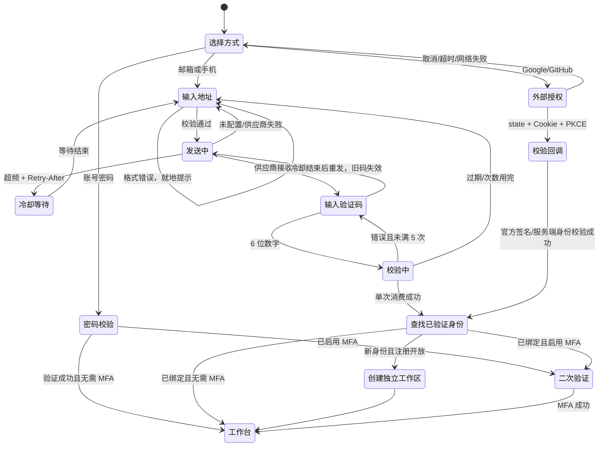

# BidProof 统一认证：配置与验收

## 已实现的入口

- 邮箱 6 位验证码（SMTP / Resend HTTPS）、手机号 6 位验证码（Twilio Messaging API）；验证码正确后，已有已验证身份进入原工作区，新身份在 `BIDPROOF_PERSONAL_SIGNUP=1` 时创建独立个人工作区。
- Google OIDC、GitHub OAuth：服务端授权码交换、PKCE S256、浏览器 HttpOnly Cookie 绑定 state、一次性 flow、10 分钟过期；Google 校验签名、issuer、audience、nonce，GitHub 读取官方 API 的不可变数字 ID。
- 原账号密码、企业 OIDC、MFA、邀请与管理员初始化兼容保留。
- 状态接口仅公布配置已齐全的通道。配置齐全表示可尝试发送/授权，不表示供应商一定投递成功；供应商拒绝或网络失败明确返回错误。

## 配置

密钥只放服务端环境变量或平台 Secret，不提交 `.env`，不注入 Vite。迁移：`python -m app.dbctl upgrade`，最新 revision `e3f4a5b6c7d8`。新增 `auth_challenges`、`auth_delivery_guards`、`auth_rate_limits` 表；已有账号和扫描数据不变。

公共设置：

| 变量 | 用途 |
| --- | --- |
| `BIDPROOF_PERSONAL_SIGNUP=1` | 允许已验证的新身份创建独立工作区；设为 0 后只允许已有绑定登录 |
| `BIDPROOF_OTP_SECRET` | 至少 32 字符的随机秘密，供验证码与限流标识 HMAC；所有 Web 实例必须一致，轮换会使在途验证码失效 |
| `BIDPROOF_PUBLIC_ORIGIN` | OAuth 回调的固定公共来源，例如 `https://bidproof.example.com`，生产必须 HTTPS |

邮件传输选择：`BIDPROOF_EMAIL_PROVIDER=smtp`（默认）或 `resend`。

当前 Render Free 试点应选择 **Resend HTTPS（443）** 路径；本轮仅交付适配代码，尚未配置到线上。Render 官方确认 Free Web Service 禁止出站 25/465/587 端口，因此常规 SMTP 配置不能作为该部署的验收路径：[Render Free 限制](https://render.com/docs/free)。

Resend HTTPS：

| 变量 | 用途 |
| --- | --- |
| `BIDPROOF_EMAIL_PROVIDER=resend` | 选择 HTTPS 邮件适配器 |
| `BIDPROOF_RESEND_API_KEY` | Resend 服务端发送权限密钥 |
| `BIDPROOF_EMAIL_FROM` | 已验证发信域名的发件地址 |

同时仍须 `BIDPROOF_OTP_SECRET` 和 `BIDPROOF_PERSONAL_SIGNUP=1`。适配器调用 `POST https://api.resend.com/emails`，供应商返回邮件 ID 后才进入验证码页面；成功接收请求不代表已送达收件箱。未创建付费账号或发送真实邮件。接口依据：[Resend Send Email](https://resend.com/docs/api-reference/emails/send-email)。

SMTP（适用于支持 SMTP 出站的部署或本机验收）：

| 变量 | 用途 |
| --- | --- |
| `BIDPROOF_SMTP_HOST` | SMTP 主机 |
| `BIDPROOF_SMTP_PORT` | STARTTLS 默认 587；隐式 TLS 默认 465 |
| `BIDPROOF_SMTP_SECURITY` | `starttls`（默认）或 `tls` |
| `BIDPROOF_SMTP_FROM` | 已获供应商许可的发信地址，例如 `BidProof <login@example.com>` |
| `BIDPROOF_SMTP_USERNAME` / `BIDPROOF_SMTP_PASSWORD` | SMTP 凭据 |

只在非生产环境且 HOST 为 localhost / 127.0.0.1 / ::1 时允许 `SMTP_SECURITY=plain`，用于本机 SMTP 收件箱验收。没有任何“返回测试验证码”的 API。建议完成 SPF / DKIM / DMARC 和实际收件验收；本次自动化测试没有向外部地址发信。当前 Render Free 的常用 SMTP 端口被平台禁用，应按上方配置 HTTPS 方式。

短信：

| 变量 | 用途 |
| --- | --- |
| `BIDPROOF_TWILIO_ACCOUNT_SID` | `AC` 开头的账户 SID |
| `BIDPROOF_TWILIO_AUTH_TOKEN` | 服务端密钥 |
| `BIDPROOF_TWILIO_FROM` | 可发送的 Twilio 号码或已获许可的 Sender ID |
| `BIDPROOF_SMS_ALLOWED_PREFIXES` | 明确允许的国家区号，逗号分隔，例如 `+86`；未配置则关闭短信入口 |

支持中国大陆 11 位号码自动补 `+86`，其他号码输入 E.164 格式。供应商目的地可达性、当地发送要求与 Sender 资格以账户实际开通情况为准；代码不会把队列接收伪装成已送达。此次未使用真实短信额度。生产启用前验证目标国家/运营商送达。

OAuth：

| 通道 | 环境变量 | 平台登记的回调 |
| --- | --- | --- |
| Google | `BIDPROOF_GOOGLE_CLIENT_ID`、`BIDPROOF_GOOGLE_CLIENT_SECRET` | `${BIDPROOF_PUBLIC_ORIGIN}/api/auth/oauth/google/callback` |
| GitHub | `BIDPROOF_GITHUB_CLIENT_ID`、`BIDPROOF_GITHUB_CLIENT_SECRET` | `${BIDPROOF_PUBLIC_ORIGIN}/api/auth/oauth/github/callback` |

请在对应平台创建 Web OAuth 客户端并逐字登记回调地址。平台 secrets 不进入浏览器。测试使用注入的供应商 HTTP 边界和真实 RSA 签名 JWT；真实客户端授权/平台审核仍需部署者配置后验收。

## API 合约

```
GET /api/auth/status
  passwordless: { email: boolean, phone: boolean,
                  oauth: [{ id: 'google'|'github', label, url }] }

POST /api/auth/challenges
  { channel: 'email'|'sms', identifier: string }
  -> { challenge_id, channel, masked_identifier, expires_in: 300, resend_after: 60 }

POST /api/auth/challenges/verify
  { challenge_id, code: '123456' }
  -> { user_id, workspace_id, username, role }
  OR { mfa_required: true, mfa_token, username }
```

错误统一为 `detail: {code, message}`。429 与发送失败 503 带 `Retry-After`，前端以服务端返回值更新倒计时。

| 状态 | HTTP / code | 用户动作 |
| --- | --- | --- |
| 格式错误 / 不支持地区 | 422 / INVALID_IDENTIFIER | 保留输入，就地更正 |
| 未配置入口 | 503 / CHANNEL_UNAVAILABLE | 选择其他登录方式 |
| 冷却中 | 429 / OTP_COOLDOWN | 等待剩余倒计时 |
| 发送或校验超频 | 429 / OTP_RATE_LIMIT | 等待 Retry-After |
| 供应商发送失败 | 503 / DELIVERY_UNAVAILABLE | 60 秒后重新获取 |
| 验证码错误 | 401 / OTP_INCORRECT | 重输，最多 5 次 |
| 次数用完 | 429 / OTP_LOCKED | 等待后重新获取 |
| 过期 / 重放 / 被重发替代 | 410 / OTP_EXPIRED | 获取新验证码 |
| 新注册关闭 | 403 / SIGNUP_CLOSED | 原方式登录或联系管理员 |
| 旧账号名称冲突 | 409 / ACCOUNT_LINK_REQUIRED | 使用原账号密码登录 |
| 账号停用 | 403 / ACCOUNT_DISABLED | 联系管理员 |

OAuth 回调只重定向本地 `/app`，失败带固定短枚举 `auth_error=cancelled|expired|provider|unavailable|signup_closed|account_link_required`；不把供应商错误描述或 token 放入 URL。需要 MFA 的结果复用现有二次验证页面。

## 状态机



## 安全边界与身份连续性

验证码有效 5 分钟，60 秒重发间隔，单码最多尝试 5 次；每来源 IP 每小时最多 20 次发送 / 100 次校验，每接收地址每小时最多 5 次发送。计数与冷却在数据库通过条件 UPSERT 原子执行，多个 Web 实例共享；测试覆盖并行请求。OAuth 开始授权每 IP 每小时最多 30 次。采用固定窗口，具体等待由服务器提供；原始 `X-Forwarded-For` 不参与额度桶。

验证码只保留 HMAC；重发使旧码失效；成功码只消费一次；过期挑战在后续发送时清理（保留不超过一天的历史记录）。六位验证码不是 MFA 的替代物；既有 MFA 账户仍必须完成 TOTP/恢复码。

旧版用户名长得像邮箱，不等于已验证的邮箱。系统不会凭匹配字符串给 OTP 使用者原账户 OWNER 权限；这类账号继续使用原密码。Google、GitHub、邮箱、手机号分别以各自已验证的稳定身份记录，不自动合并。跨方式绑定/合并账户需要后续显式认证后操作，本轮没有隐式账户合并。首次验证码注册只创建自己的工作区；邀请加入企业空间继续沿用已有邀请流程。

用户/工作区/身份绑定写入同一事务，失败整体回滚。SMTP/Twilio 调用使用 10 秒网络超时；不自动重试发送，避免重复消息。所有供应商 HTTP 请求 HTTPS、禁止重定向携带 secret、限制响应大小；凭据与供应商错误详情不返回客户端。

## 验收

`python -m pytest -q tests/test_passwordless_auth.py tests/test_auth_lifecycle.py tests/test_production_identity_hardening.py`

覆盖邮箱/手机正常流、重复登录同一工作区、隔离注册、格式校验、掩码、验证码不泄露、冷却、重发、过期、5 次错误、并发单次消费、并发频控、发送失败、原账户防接管、禁用/关闭注册、MFA、事务回滚、Google RSA 签名与错误 audience、GitHub PKCE/browser state/replay、取消授权、SMTP/Twilio 适配器。

尚需真实部署配置后的验收：邮件收件率、短信目标地区送达、Google/GitHub 实际授权、生产 HTTPS Cookie 与数据库迁移。自动化测试不等于真实供应商或企业业务验收。

接口依据：[Twilio Message resource](https://www.twilio.com/docs/messaging/api/message-resource)、[GitHub OAuth web flow](https://docs.github.com/en/apps/oauth-apps/building-oauth-apps/authorizing-oauth-apps)、[Google OpenID Connect](https://developers.google.com/identity/openid-connect/openid-connect)。
