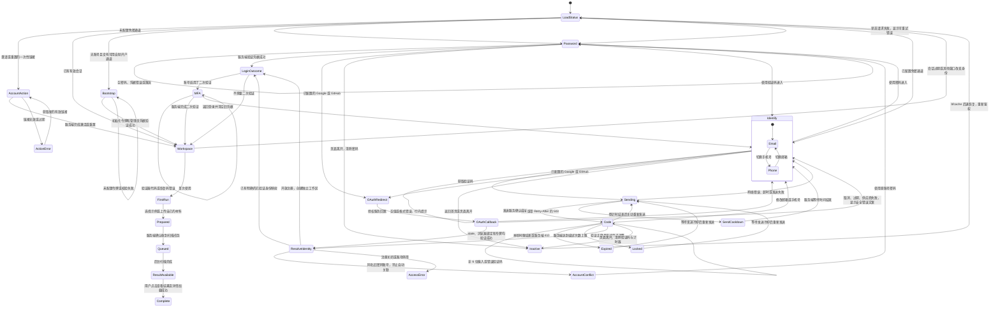

# 统一认证与首次进入：实际状态机

日期：2026-09-24。适用于本次 `BID_0924.zip` 独立工作副本。

## 用户入口

主界面只有「开始检查投标材料」，不让用户先判断自己应该注册还是登录。已配置邮箱时默认邮箱验证码；仅配置短信时默认手机号。验证成功后，服务端根据已验证身份映射返回原账号，或在允许个人注册时创建独立工作区。第一步不收集公司名、职位或头像。

Google / GitHub 只在服务器配置完整时显示可用按钮。邮箱、短信均未配置时，首屏保留真实可用的「邮箱或现有账号 + 密码」；允许个人注册的环境提供次级创建入口。未配置的服务不展示假发送、假 OAuth 或成功提示。

## 状态图

OAuth 回跳的 `auth_error` 只接受固定文案枚举；`mfa_token` 和错误参数读取后从地址栏及当前历史项移除。供应商会话信息、验证码、密码和身份令牌都不会写入首次使用进度存储。

## 服务端契约与异常交互

| 接口 / 状态 | 真实行为 | 界面反馈 |
|---|---|---|
| `GET /api/auth/status` | 返回登录状态、初始化要求及 `passwordless.email/phone/oauth` | 仅展示实际启用通道 |
| `POST /api/auth/challenges` | 输入 `channel: email/sms`、`identifier`；真实发送后返回挑战 ID、掩码地址、有效时长与重发间隔 | 进入单个 6 位验证码输入框，焦点自动跟随 |
| `POST /api/auth/challenges/verify` | 输入挑战 ID 和验证码；一次性消费后返回用户或 MFA 挑战 | 只有服务端确认才进入工作台；MFA 不跳过 |
| `POST /api/auth/login` | 现有用户名或明确绑定的邮箱 + 已设置的密码 | 原有密码账号继续可用 |
| `GET /api/auth/oauth/{google/github}/start` | 服务端构造授权请求并设置浏览器绑定 | 同源已知路径链接，无前端密钥 |
| `422 INVALID_IDENTIFIER` | 不合法地址或不支持的短信地区 | 行内错误，保留输入 |
| `429 OTP_COOLDOWN / OTP_RATE_LIMIT` | 持久化发送频控 | 按真实 `Retry-After` 截止时间禁用重试 |
| `503 CHANNEL_UNAVAILABLE / DELIVERY_UNAVAILABLE` | 配置不可用或投递失败 | 保留接收地址，提示选择其他通道或稍后重试；不显示「已发送」 |
| `401 OTP_INCORRECT` | 错码消耗一次验证机会 | 保留当前挑战，焦点回到验证码 |
| `410 OTP_EXPIRED` | 已过期、已使用或已撤销 | 禁用旧码验证，允许冷却后重新发送 |
| `429 OTP_LOCKED` | 尝试上限达到 | 旧码停用，等待后获取新码 |
| `409 ACCOUNT_LINK_REQUIRED` | 邮箱 / 账号与旧密码身份冲突 | 提示使用原账号密码；不擅自合并 |
| `403 SIGNUP_CLOSED / ACCOUNT_DISABLED` | 注册未开放或账号已停用 | 明确提示联系管理员，不创建替代账号 |
| 网络断开 / 超时 | 写请求不自动重放 | 显示网络状态，用户主动重试 |

当前验证码有效期为 **5 分钟**，发送冷却 **60 秒**，每个挑战最多 **5 次**错误尝试。服务器还限制每个 IP 每小时 20 次发送、每个接收地址每小时 5 次发送，以及每个 IP 每小时 100 次验证。客户端倒计时只提供反馈，服务端持久化校验才是最终限制。

前端基于绝对截止时间计算倒计时，后台标签页暂停不延长有效期。重发、返回、关闭、成功和页面离开都会结束该视图拥有的计时器或请求。后台恢复时重新读取认证状态，不复活旧验证码；已有会话恢复监听与弹窗恢复共存时只执行一次状态刷新。

## 输入与无障碍

- 邮箱去空白并小写；邮箱格式与服务端对齐。手机号去除空格和常见分隔符，中国大陆 11 位号码补 `+86`，其他地区要求国际区号，服务器仍会校验允许地区。
- 验证码用一个文本输入框，提供 `inputmode="numeric"` 与 `autocomplete="one-time-code"`，支持整体粘贴、系统自动填充和全角数字；不强迫用户在六个输入框间跳转。
- 原生 `<dialog>` 负责焦点约束，进入各步骤主动聚焦；关闭后恢复触发点。应用尚未登录时 Escape 保留登录入口，可通过「返回首页」离开。
- 表单错误使用 `role="alert"`、`aria-invalid` 和关联说明；发送中锁定重复操作并声明 `aria-busy`；倒计时不会每 250 毫秒重复播报相同秒数。
- 接收地址、错误信息和所有动态片段经过 SafeHtml；OAuth 地址另外限制为已知同源端点。

## 模块位置

| 模块 | 文件 | 职责 |
|---|---|---|
| 极简认证弹窗 | [unified.js](../../frontend/src/features/auth/unified.js) | 步骤、请求所有权、可访问渲染、页面恢复 |
| 输入与倒计时 | [passwordless-state.js](../../frontend/src/features/auth/passwordless-state.js) | 纯校验、规范化、截止时间计时器、OAuth 白名单 |
| 认证编排 | [index.js](../../frontend/src/features/auth/index.js) | 主入口与旧初始化 / 邀请 / 重置 / MFA 衔接 |
| 旧认证状态与视图 | [state.js](../../frontend/src/features/auth/state.js)、[view.js](../../frontend/src/features/auth/view.js) | 保留特殊企业账号流程 |
| API 与错误契约 | [auth.js](../../frontend/src/api/auth.js)、[http.js](../../frontend/src/core/http.js) | 请求、取消、结构化错误、Retry-After |
| 验证码服务 | [passwordless_service.py](../../app/services/passwordless_service.py) | 投递、频控、挑战消费、账号创建与 MFA 交接 |
| 发送适配器 | [auth_delivery.py](../../app/auth_delivery.py) | 服务端 SMTP / Resend / Twilio 配置 |
| 首次使用进度 | [onboarding.js](../../frontend/src/features/runs/onboarding.js) | 按用户与工作区隔离的三步进度 |
| 模板与队列编排 | [app.js](../../frontend/src/app.js) | 真实文件准备、FormData 上传、查看结果推进 |

## 当前边界与验收证据

1. 邮箱、手机号、Google、GitHub 是独立的已验证身份来源；**不凭相同邮箱自动合并旧账号或不同提供方账号**。需要跨身份合并时，应另行建立登录后双重证明的账号关联流程。
2. 密码入口服务于已经设置密码的账号。免密开户不会生成可猜测默认密码，也不能凭首次填写的密码接管同名账号。
3. 真实邮箱 / 短信 / OAuth 可用性取决于服务器凭据与回调配置；本地发送验收不等于外部供应商、投递率或所有手机地区已经验收。生产秘钥不放前端，不写入示例文件。
4. 首次使用示例始终标记「合成示例」。选择模板只准备招标和企业材料两份文件，用户确认后才提交实际扫描队列。扫描完成但尚未查看详情时，进度停在 2 / 3，不宣称完成首次体验。
5. [test-auth-unified.mjs](../../frontend/scripts/test-auth-unified.mjs) 覆盖真实认证模块、格式防错、粘贴、错误重试、频控、过期、MFA、SafeHtml、关闭竞态及 bfcache 双监听恢复；HTTP 使用测试替身。
6. [test-first-run-starters.mjs](../../frontend/scripts/test-first-run-starters.mjs) 从真实空首页按钮走到示例文件、原生 FormData、后台事件和详情页，验证旧响应不能覆盖手工选择或登出后的空状态。测试补足 jsdom 缺失的原生文件重置行为，不替换应用业务逻辑。
7. 这些 DOM 与协议检查不能替代浏览器视觉验收，也不代表 OCR 准确率或真实企业投标任务通过。
